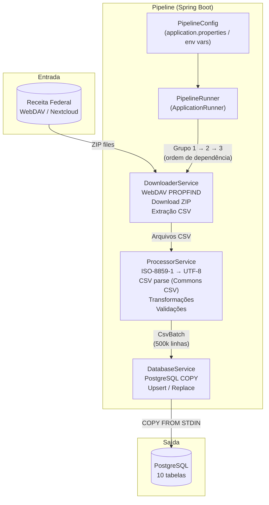
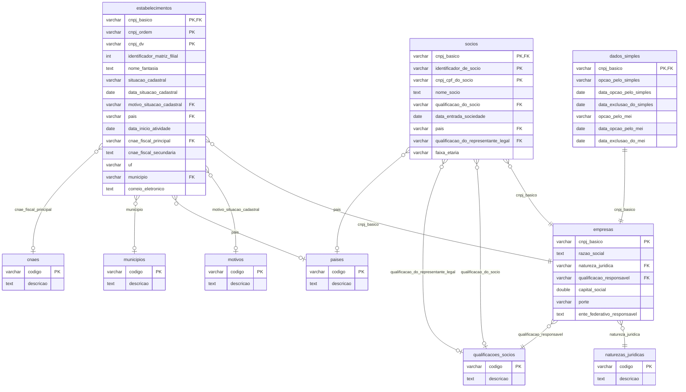

# CNPJ Data Pipeline

ETL em Java Spring Boot que baixa os dados públicos de empresas da **Receita Federal do Brasil** via WebDAV e os carrega em um banco PostgreSQL. Réplica fiel do pipeline Python original, com suporte a estratégias de carga incremental (upsert) e total (replace).

---

## Diagrama de Arquitetura



---

## Diagrama de Relacionamento entre Tabelas (ER)



---

## Pré-requisitos

- Java 17+
- Maven 3.8+ (ou use o `mvnw` incluído)
- PostgreSQL 14+

---

## Configuração

Todas as opções são configuradas via variáveis de ambiente (ou `application.properties`):

| Variável | Padrão | Descrição |
|---|---|---|
| `DATABASE_URL` | `jdbc:postgresql://localhost:5432/cnpj` | URL JDBC do banco |
| `DB_USER` | `postgres` | Usuário do banco |
| `DB_PASSWORD` | `postgres` | Senha do banco |
| `LOADING_STRATEGY` | `upsert` | `upsert` (incremental) ou `replace` (truncate + insert) |
| `OUTPUT_FORMAT` | `postgres` | `postgres` ou `parquet` |
| `BATCH_SIZE` | `500000` | Linhas por lote de carga |
| `DOWNLOAD_WORKERS` | `4` | Downloads paralelos |
| `PROCESS_WORKERS` | `1` | Workers paralelos dentro de cada grupo |
| `RETRY_ATTEMPTS` | `3` | Tentativas em caso de falha de download |
| `RETRY_DELAY` | `5` | Segundos entre tentativas |
| `TEMP_DIR` | `./temp` | Diretório temporário para ZIPs e CSVs |
| `KEEP_DOWNLOADED_FILES` | `false` | Manter arquivos temporários após carga |
| `PARQUET_OUTPUT_DIR` | `./parquet` | Diretório de saída Parquet |
| `BASE_URL` | URL Receita Federal | Endpoint WebDAV |

---

## Como executar

### Build

```bash
./mvnw clean package -DskipTests
```

### Executar

```bash
# Listar meses disponíveis
java -jar target/cnpjDataPipeline-0.0.1-SNAPSHOT.jar --list

# Processar o mês mais recente
java -jar target/cnpjDataPipeline-0.0.1-SNAPSHOT.jar

# Processar um mês específico
java -jar target/cnpjDataPipeline-0.0.1-SNAPSHOT.jar --month=2024-11

# Forçar reprocessamento (ignora tracking de arquivos já processados)
java -jar target/cnpjDataPipeline-0.0.1-SNAPSHOT.jar --month=2024-11 --force
```

### Com variáveis de ambiente

```bash
DATABASE_URL=jdbc:postgresql://myhost:5432/cnpj \
DB_USER=myuser \
DB_PASSWORD=mypassword \
LOADING_STRATEGY=replace \
BATCH_SIZE=1000000 \
java -jar target/cnpjDataPipeline-0.0.1-SNAPSHOT.jar
```

---

## Estratégias de Carga

### Upsert (padrão)
- Usa tabela temporária + `INSERT ... ON CONFLICT DO UPDATE`
- Mantém disponibilidade durante a carga
- Ideal para atualizações incrementais mensais
- Rastreia arquivos processados em `processed_files` (permite retomada)

### Replace
- Executa `TRUNCATE` seguido de `COPY` direto
- Mais rápido para carga inicial completa
- Não há tracking de progresso (recomeça do zero se interrompido)

---

## Ordem de Processamento

Os arquivos são processados em grupos de dependência para garantir integridade referencial:

| Grupo | Tabelas | Descrição |
|---|---|---|
| 1 | `cnaes`, `motivos`, `municipios`, `naturezas_juridicas`, `paises`, `qualificacoes_socios` | Tabelas de referência (sem dependências) |
| 2 | `empresas` | Depende do Grupo 1 |
| 3 | `estabelecimentos`, `socios`, `dados_simples` | Dependem do Grupo 2 |

Arquivos dentro do mesmo grupo podem ser processados em paralelo (configurável via `PROCESS_WORKERS`).

---

## Schema do Banco

O schema é criado automaticamente na primeira execução a partir de `src/main/resources/initial.sql`.

**Tabelas principais:**
- `empresas` — Dados cadastrais das empresas (CNPJ raiz)
- `estabelecimentos` — Filiais e matrizes (endereço, situação, CNAE)
- `socios` — Quadro societário
- `dados_simples` — Opção pelo Simples Nacional / MEI

**Tabelas de referência:**
- `cnaes` — Classificação Nacional de Atividades Econômicas
- `motivos` — Motivos de situação cadastral
- `municipios` — Códigos de municípios
- `naturezas_juridicas` — Naturezas jurídicas
- `paises` — Países
- `qualificacoes_socios` — Qualificações de sócios

**Tracking:**
- `processed_files` — Controle de arquivos já carregados (evita reprocessamento)

---

## Fonte dos Dados

Os dados são disponibilizados mensalmente pela Receita Federal do Brasil:
- Portal: [dados.gov.br](https://dados.gov.br/dados/conjuntos-dados/cadastro-nacional-da-pessoa-juridica---cnpj)
- Tamanho aproximado: ~85 GB (CSV) / ~6 GB (Parquet comprimido)
- Encoding: ISO-8859-1
- Separador: `;`
- Atualização: Mensal
